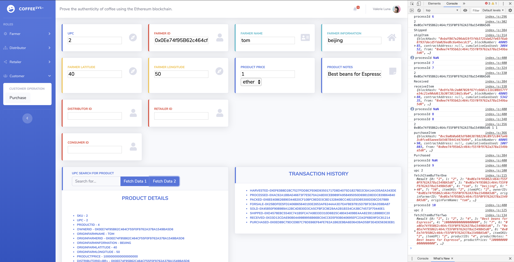
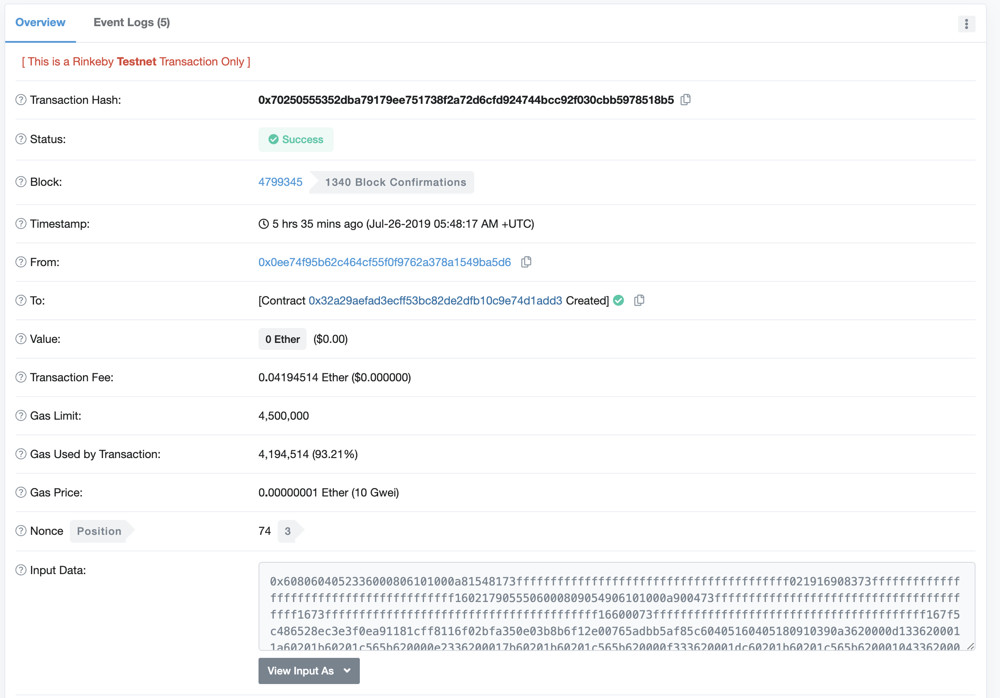
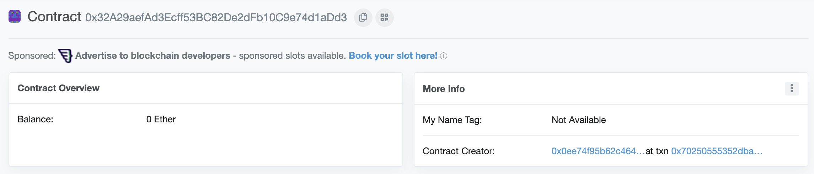
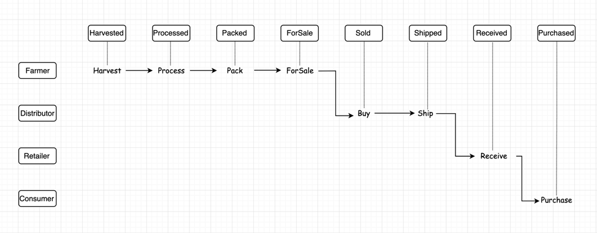
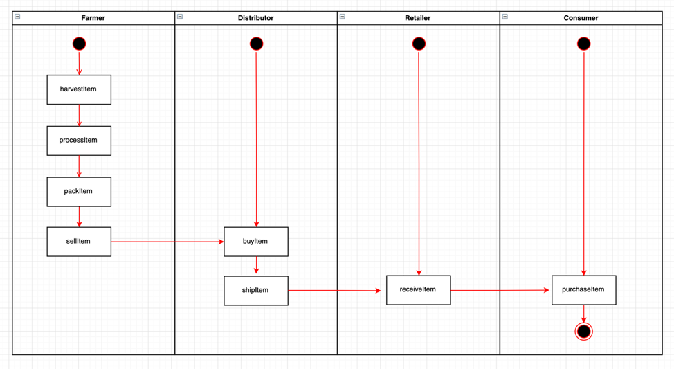
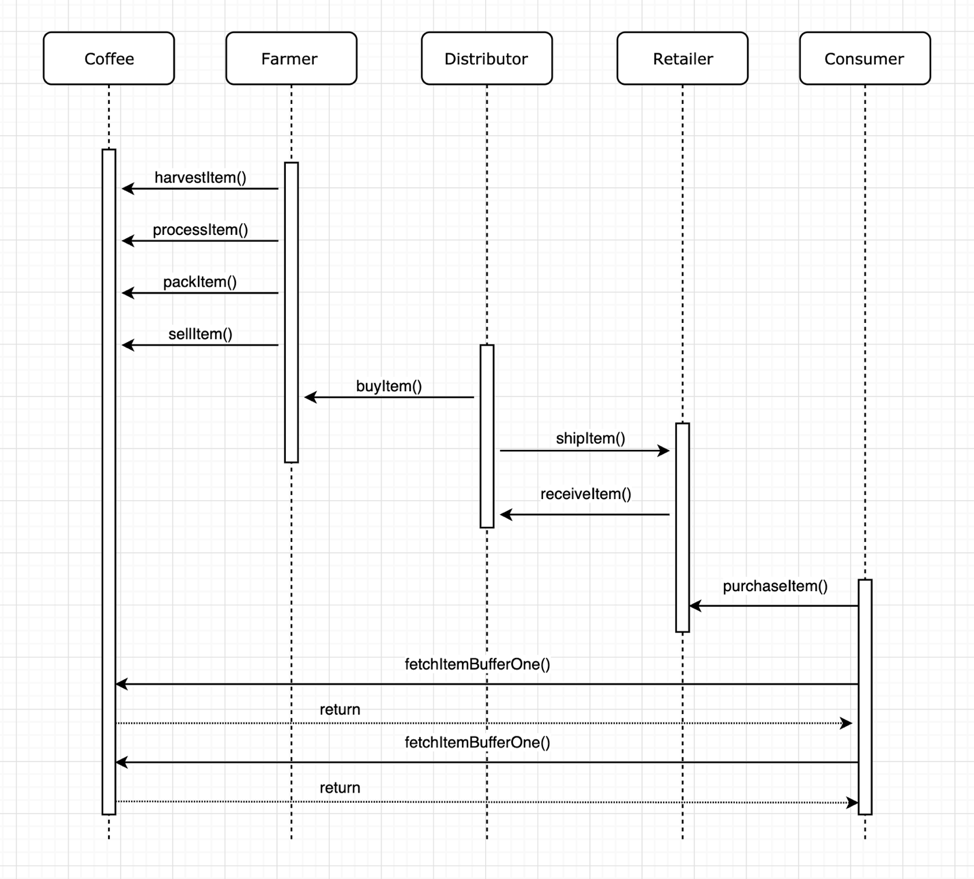
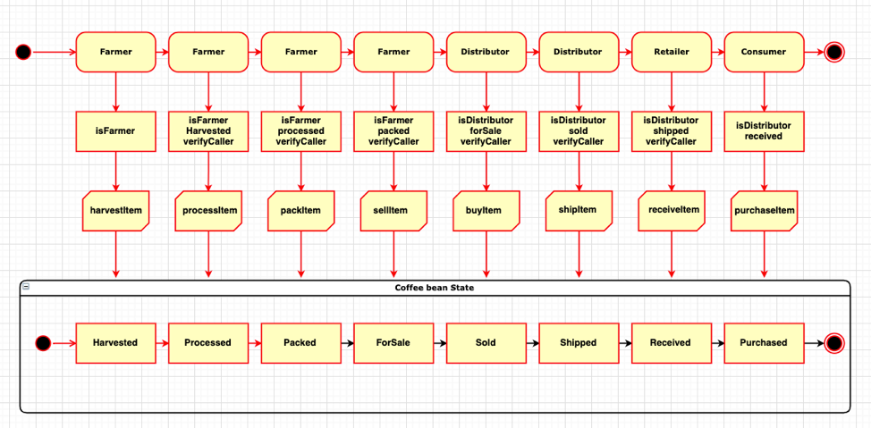

# Coffee Bean Supply chain (Ethereum)

This project is an Ethereum DApp to trace business process history in a Supply Chain flow.




### Info of project

* Truffle v5.0.20 (core: 5.0.20)
* Solidity v0.5.0 (solc-js)
* Node v10.16.0
* Web3.js v1.0.0-beta.37

### Install dependencies

```
$ sudo npm install
```

Front-end dependencies
```
$ cd app
$ sudo npm install --unsafe-perm
```

### Smart contract
Transaction Hash : 0x11eaaeee585e8c04b6044d7f70f4ee422ded8dc65bea8f292fe3065069fb4650



Contract address:  0x9DC1F74C58Be10d0EB9eECf6f27CdAb0b91fCbdf



## Planning overview



### Activity diagram



### Sequence diagram



### State diagram



### Configuring Private network in

Launch Ganache:

```
ganache-cli -m "spirit supply whale amount human item harsh scare congress discover talent hamster"
```

Go to your Metamask Chrome Extension
Use option, Connect using “Custom RPC”, at address http://127.0.0.1:8545/
Use the Private Keys provided by Truffle to import at least two accounts.


## Running DAPP

To run your application you will need to:

```
$ truffle develop
```
or
```
$ sudo truffle develop commands
```
Every time to compile the contract ,you'd better to delete build folder. and run compile with --all.
```
> compile --all
```
```
> migrate --reset
```

Then

Open a second terminal window, and make sure you are inside your project directory.
Run cd app to move inside the app folder.
Run

```
$ npm run dev
```
`dev` is script of webpack.This will start our port at 8080. Open http://localhost:8080/ in your browser. Make sure the Metamask extension is installed.you are logged into http://127.0.0.1:8545 private network.

## Test DAPP

Run. when did steps of Running DAPP.

```
$ truffle test
```

Tests with Mocha and Chai in TestSupplychain.js.  Using artifacts that is resolver.

Refer to the following

truffle/packages/truffle-require/require.js - [GitHub](https://github.com/tomgtbst/truffle/blob/develop/packages/truffle-require/require.js)

```
 const fs = require("fs");
 const path = require("path");
 const Module = require("module");
 const vm = require("vm");
 const originalrequire = require("original-require");
 const expect = require("truffle-expect");
 const Config = require("truffle-config");
 const Web3Shim = require("truffle-interface-adapter").Web3Shim;

  ...
 const context = {
  ...

  artifacts: options.resolver,
  setImmediate: setImmediate,
  setInterval: setInterval,
  setTimeout: setTimeout

  ...
}
  ...
const script = vm.createScript(source, file);
script.runInNewContext(context);
  ...
```  

It seems like Running a V8 in your computer. The artifacts is resolver, So we can interact with Contracts by ```const SupplyChain = artifacts.require('SupplyChain')```in TestSupplychain.js

## Migrate DAPP to Rinkeby Test Network

 * You will need to have your Metamask’s seed and Infura setup. Connect Rinkeby network in Metamask and Get Testnet Coins from [Test Ether Faucet](https://faucet.rinkeby.io/) or Google it.
 * Update the truffle.config file to add settings to deploy your contract to the Rinkeby Public Network.
 * Edit your mnemonic of MetaMask in '.secret'


 ```
 const HDWalletProvider =   require('truffle-hdwallet-provider');
 const infuraKey = "INPUT YOUR INFURAKEY";

 const fs = require('fs');
 const mnemonic = fs.readFileSync(".secret").toString().trim();```


 rinkeby: {
  provider: () => new HDWalletProvider(mnemonic, `https://rinkeby.infura.io/v3/${infuraKey}`),
    network_id: 4,       // rinkeby's id
    gas: 4500000,        // rinkeby has a lower block limit than mainnet
    gasPrice: 10000000000
},
```

Deploy Contract to Rinkeby:

```
$ truffle migrate --reset --network rinkeby
```


## Versioning

We use [SemVer](http://semver.org/) for versioning. For the versions available, see the [tags on this repository](https://github.com/your/project/tags).

## Built With

* [Ethereum](https://www.ethereum.org/) - Ethereum is a decentralized platform that runs smart contracts
* [IPFS](https://ipfs.io/) - IPFS is the Distributed Web | A peer-to-peer hypermedia protocol
to make the web faster, safer, and more open.
* [Truffle Framework](http://truffleframework.com/) - Truffle is the most popular development framework for Ethereum with a mission to make your life a whole lot easier.

## Authors

* **Tom** - *Fullstack egineer* - [github profile](https://github.com/tomgtqq)

If you have any question. feel free to contact me.

## License

This project is licensed under the MIT License
